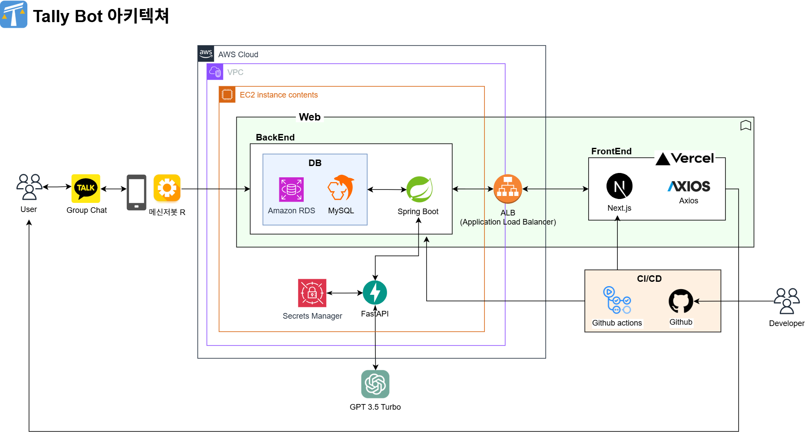

# Tally Bot
## 프로젝트 개요
### 여행, 회식 등 일상 속 복잡하고 귀찮은 정산을 카톡 한 줄로 단순하게!

친구들과 여행을 갔다 오면 정산이 번거로웠던 경험이 모두 있을 것입니다. **기존의 정산 관련 서비스들은 지출을 자세히 기록해야 정산결과를 얻는다는 불편함**이 있습니다.

Tally Bot은 별도의 앱 설치나 지출 기록 없이 **카카오톡 대화만으로 정산**해주는 챗봇으로, 사용자의 작업을 최소화하고 정산 피로도를 해소해줍니다.

## Architecture

  
   

### 1. AI - 카카오톡 채팅 기반 지출 및 거래내역 분석
Tally Bot이 초대된 단체 카카오톡방에서 사용자가 정산을 요구하면 해당 기간의 채팅내역을 AI(GPT 3.5 Turbo)가 분석하여 정산정보를 json 형식으로 정리합니다. [결제자, 정산 대상자, 결제 장소, 정산 항목, 정산 비율, 총 금액, 부담금액]

### 2. 백엔드 - 최적 송금횟수 탐색 알고리즘
AI가 추출한 정보를 바탕으로 직접 만든 최적 송금횟수 탐색 알고리즘을 통해 최종 정산결과를 도출합니다. 정산 결과와 세부내역을 확인할 수 있는 웹 URL은 사용자에게 카카오톡으로 전송됩니다.

### 3. 프론트엔드 - 상세내역 확인
하나의 채팅방의 정산을 모두 확인 할 수 있습니다. 정산 상세내역을 확인하고 수정할 수 있고, 재정산 요청 역시 가능하다. 송금을 완료했다면 정산 완료 처리를 할 수 있습니다.

## 컴포넌트
이 프로젝트는 다음 3가지 주요 컴포넌트로 구성되어 있습니다. 각 페이지의 리드미 링크에서 해당 컴포넌트에 대한 자세한 설명을 확인할 수 있습니다.

### [AI Core Service](./ai-core-service/README.md)

AI 모델을 활용하여 카카오톡 대화에서 정산 관련 내용을 추출합니다.

### [API Backend](./api-backend/README.md)

애플리케이션의 백엔드 API와 비즈니스 로직을 담당합니다. 직접 개발한 최적 송금횟수 탐색 알고리즘을 통해 최종 정산결과를 도출합니다. 

### [Client Frontend](./client-frontend/README.md)

사용자 인터페이스와 클라이언트 측 로직입니다.

### [Chatbot Frontend](./chatbot-frontend/README.md)

사용자와 직접 소통하는 챗봇 로직입니다.

## 시연 영상
https://www.youtube.com/watch?v=scUuIBDw6cU
